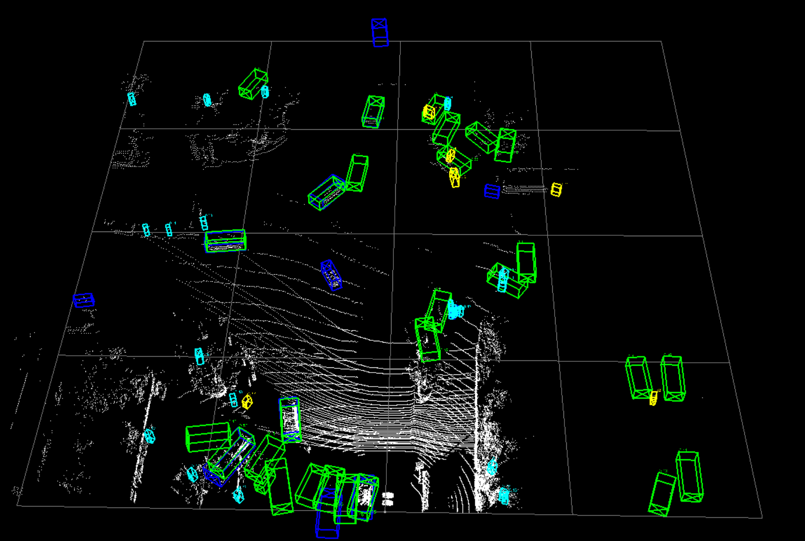

# autolabeling

3D目标自动标注检测部分

## 环境配置
### Installation
1、安装openpcdet 

编译pcdet时，python setup.py develop需要在Voxelnext文件夹下操作，这样才能在Voxelnext内部使用pcdet，Voxelnext内的pcdet是0.6.0版本

2、安装hj_dataset_devkit依赖

如果python版本是3.7，则无法安装Argoverse2，会出现下面警告可以忽视，不影响正常训练

WARN: Argoverse2 api need Python>=3.8. Argoverse2 not support in this environment

3、可视化库mayavi/open3d
## 数据准备
  
- 将数据放到data/my下的training和testing文件夹下通过make_imageset.py划分对应的训练集和测试集
- 通过my_dataset.py生成pkl文件，并生成gt_sampling数据库采样

```shell
python -m pcdet.datasets.my.my_dataset create_my_infos tools/cfgs/dataset_configs/my_dataset.yaml
```
例如
```shell
---------------Start to generate data infos---------------
INFO: checking file structure of: /media/gpu/sde/tianxl/gitlab/github/autolabeling/VoxelNeXt-master/data/my/training
INFO: check finished, 1 scene(s) found under path
INFO: /media/gpu/sde/tianxl/gitlab/github/autolabeling/VoxelNeXt-master/data/my/training/hongjing_fastload.cache is written
[<dataset_sdk.hongjing_devkit.HongjingScene object at 0x7fe3c1dff310>]
train sample_idx: 0
Num of Train Infos:  29
my info train file is saved to /media/gpu/sde/tianxl/gitlab/github/autolabeling/VoxelNeXt-master/data/my/my_infos_train.pkl
INFO: checking file structure of: /media/gpu/sde/tianxl/gitlab/github/autolabeling/VoxelNeXt-master/data/my/testing
INFO: check finished, 0 scene(s) found under path
INFO: /media/gpu/sde/tianxl/gitlab/github/autolabeling/VoxelNeXt-master/data/my/testing/hongjing_fastload.cache is written
[]
Num of val Infos:  0
my info val file is saved to /media/gpu/sde/tianxl/gitlab/github/autolabeling/VoxelNeXt-master/data/my/my_infos_val.pkl
Num of val Infos:  29
my info trainval file is saved to /media/gpu/sde/tianxl/gitlab/github/autolabeling/VoxelNeXt-master/data/my/my_infos_trainval.pkl
---------------Start create groundtruth database for data augmentation---------------
gt_database sample: 1/29
gt_database sample: 11/29
gt_database sample: 21/29
Database car: 214
Database motorcycle: 96
Database truck: 29
Database bicycle: 23
Database pedestrian: 126
---------------Data preparation Done---------------
```

## 训练
  
```shell
# 单卡
python train.py --cfg_file cfgs/my_models/voxelnext.yaml
# 多卡
bash scripts/dist_train.sh 4 --cfg_file cfgs/my_models/voxelnext.yaml
```

## 查看检测效果及可视化

对原来的demo.py进行了修改，运行demo_vis.py查看可视化效果，对真值和预测框进行可视化

<p align="center">  </p>